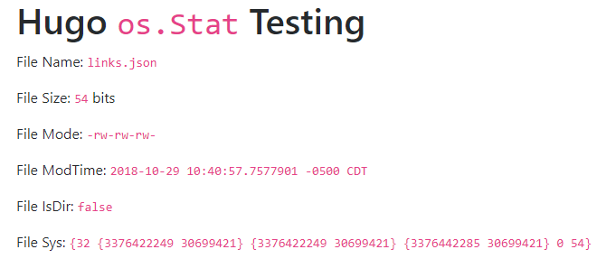

# Hugo `os.Stat` Test

A sample project for testing the Hugo function [`os.Stat`](https://gohugo.io/functions/os.stat/), inspired by [this discussion forum thread](https://discourse.gohugo.io/t/os-fileinfo-modtime/14964). 

## Run It

1. [Install Hugo](https://gohugo.io/getting-started/installing/)
1. Open a command line and run:
    1. `git clone https://github.com/zwbetz-gh/hugo-os-stat-test.git`
    1. `cd hugo-os-stat-test`
    1. `hugo server`
1. Navigate to `http://localhost:1313/` in your browser

## Screenshot

